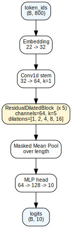
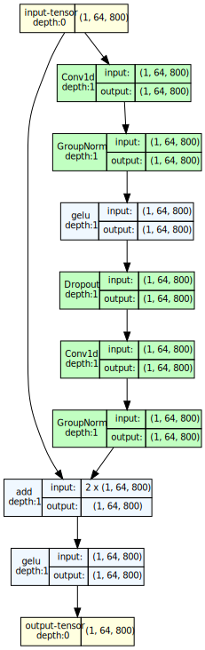

# capiti

Tiny protein-function classifier for edge deployment. Given a nucleotide
sequence encoding a protein, capiti flags whether the encoded protein is
expected to retain the enzymatic function of one of a small reference
set.

Weighs ~1 MB on disk, runs inference in tens of milliseconds on a
Raspberry Pi. Trained by distilling ProteinMPNN's function-preserving
design prior into a small 1D CNN. Bundled console scripts cover both
batch validation (`capiti`, `capiti-orf`, `capiti-translate`) and
real-time streaming during DNA synthesis
(`capiti-listen`, `capiti-watch`, `capiti-interrupt`).

**Overview** (each ResidualDilatedBlock collapsed to one box):



**Inside one ResidualDilatedBlock:**



See [`docs/capiti.summary.txt`](docs/capiti.summary.txt) for the full
per-layer size / FLOP table.

## Install

```
pip install capiti
```

## Use

```
capiti ATGCGTAAAGTGGCC...           # prints TRUE or FALSE (default set ab9)
capiti ATGCGT...  --cutoff 0.8 -v   # TRUE  p_inset=0.995
capiti --fasta seqs.fa              # batch over a FASTA
echo ATGCGT... | capiti --stdin
```

### Reference sets

`capiti` ships three bundled reference sets, selectable at invocation
time via `--set NAME` (or `CAPITI_SET`).

| set | targets | description |
|---|---|---|
| `ab9` | 9   | Beta-lactamases relevant to antibiotic resistance plus other soluble enzymes. Default. |
| `E`   | 59  | Larger enzyme panel (54 PDB + 5 AlphaFold-only entries). |
| `C`   | 235 | Broad enzyme panel sourced from PDB. |

```
capiti ATGCGT... --set ab9
capiti --fasta seqs.fa --set C
CAPITI_SET=E capiti --stdin
```

### Inference-time gate

Capiti pairs the CNN with a SIFTS-backed fixed-position gate by
default: if the model picks a target Ti and the query has a mutated
residue at any of Ti's catalytic / active-site positions, the in-set
score is forced to 0. This catches single-residue active-site
knockouts the masked-mean CNN under-weights. Disable with `--no-gate`.

Exit code is 0 on TRUE, 1 on FALSE, suitable for shell pipelines:

```
capiti ATGCGT... && echo "in set" || echo "not in set"
```

## Benchmarks

On the held-out test split for each set (gate on, prefix-aug c1
weights as shipped in 0.1.2):

| set | targets | AUC   | PR-AUC | model size |
|---|---|---|---|---|
| ab9 | 9     | 0.998 | 0.996  | 0.94 MB    |
| E   | 59    | 0.989 | 0.991  | 0.96 MB    |
| C   | 235   | 0.985 | 0.985  | 1.05 MB    |

Side-by-side comparison with BLAST and k-mer baselines at
[`docs/benchmark/CE_summary.md`](docs/benchmark/CE_summary.md). Per-set
ROC, PR, per-class plots at [`docs/benchmark/v3/`](docs/benchmark/v3/),
[`docs/benchmark/E_v1/`](docs/benchmark/E_v1/),
[`docs/benchmark/C_v1/`](docs/benchmark/C_v1/).

## Streaming inference

`capiti-watch` reads bases as they're produced by a DNA synthesizer,
finds the first ATG, translates each new codon in-process, runs the
ONNX model after every codon, and pulses an abort GPIO line when the
in-set probability holds above a threshold for several consecutive
scorings. The bundled CNN was retrained with prefix-truncation
augmentation so it gives calibrated probabilities on partial inputs;
no architecture change, just a length-aware training distribution.

```
capiti-watch                                 # default ab9, fires on real synth
capiti-watch --set any                       # multi-set: load ab9+C+E in parallel
capiti-watch --no-interrupt -v               # dry run (print verdicts, no abort)
capiti-watch --sim-nt "ATG..."               # in-silico, no Pi needed
capiti-watch --sim-fasta queries.fa --set any
capiti-watch --threshold 0.99 --stability 10 # stricter "we're sure" profile
```

Streaming-coverage at FPR<=5%, per-target TPR>=0.9 (held-out):

| set | callable by K=200 AA | by K=400 | unreachable |
|-----|---------------------:|---------:|------------:|
| ab9 | 89%                  | 100%     | 0           |
| E   | 47%                  | 83%      | 10/59       |
| C   | 66%                  | 89%      | 25/224      |

In-silico and hardware demo recipes:
[`docs/streaming_demos.md`](docs/streaming_demos.md). Background and
training-distribution rationale:
[`docs/streaming_prefix_augmentation.md`](docs/streaming_prefix_augmentation.md).

## Hardware integration (Raspberry Pi)

| script             | role                                                   |
|--------------------|--------------------------------------------------------|
| `capiti-listen`    | reconstruct nucleotide sequence from amidite + TET strobe pulses on GPIO (batch capture) |
| `capiti-watch`     | as above, but in-process scoring + abort pulse on stable trigger (streaming) |
| `capiti-interrupt` | one-shot abort pulse on GPIO17 (manual / dry-run testing) |

Wiring matches across all three (Pi 4, BCM numbering):

| Pi pin | Phys | Direction | Role                          |
|--------|------|-----------|-------------------------------|
| GPIO5  | 29   | in        | A amidite                     |
| GPIO6  | 31   | in        | G amidite                     |
| GPIO13 | 33   | in        | C amidite                     |
| GPIO19 | 35   | in        | T amidite                     |
| GPIO26 | 37   | in        | TET activator strobe          |
| GPIO22 | 15   | in        | DONE (rising edge stops capture) |
| GPIO17 | 11   | out       | Abort pulse to upstream rig   |

Each input line wants an external 10 kohm pulldown to GND; common GND
between Pi and rig required. Install with `pip install 'capiti[pi]'`
to pull in `gpiozero` + `lgpio`. Sim modes (`--sim-nt`, `--sim-fasta`)
work without the GPIO stack and are useful for in-silico validation
before deploying to hardware.

## Status

Research-grade. The CLI surface (flags, stdin/FASTA behaviour, exit
codes) is stable; bundled models may be retrained and updated between
0.x releases. Not for operational use.

## License

MIT.
