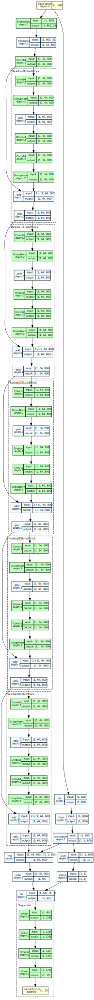

# capiti

Tiny protein-function classifier for edge deployment. Given a nucleotide
sequence encoding a protein, capiti flags whether the encoded protein is
expected to retain the enzymatic function of one of a small reference
set.

Weighs ~1 MB on disk, runs inference in tens of milliseconds on a
Raspberry Pi. Trained by distilling ProteinMPNN's function-preserving
design prior into a small 1D CNN.



See [`docs/capiti.summary.txt`](docs/capiti.summary.txt) for the full
per-layer size / FLOP table.

## Install

```
pip install capiti
```

## Use

```
capiti ATGCGTAAAGTGGCC...           # prints TRUE or FALSE
capiti ATGCGT...  --cutoff 0.8 -v   # TRUE  p_inset=0.995
capiti --fasta seqs.fa              # batch over a FASTA
echo ATGCGT... | capiti --stdin
```

Exit code is 0 on TRUE, 1 on FALSE, suitable for shell pipelines:

```
capiti ATGCGT... && echo "in set" || echo "not in set"
```

## Status

**Release: `Ab9`** — the 0.0.x line is built on 9 reference enzymes
(several antibiotic-resistance-relevant beta-lactamases, plus other
soluble enzymes). The model and reference set will change between
0.0.x releases. Expect the public CLI surface to remain stable; the
bundled model is research-grade and should not be used for anything
operational.

## License

MIT.
